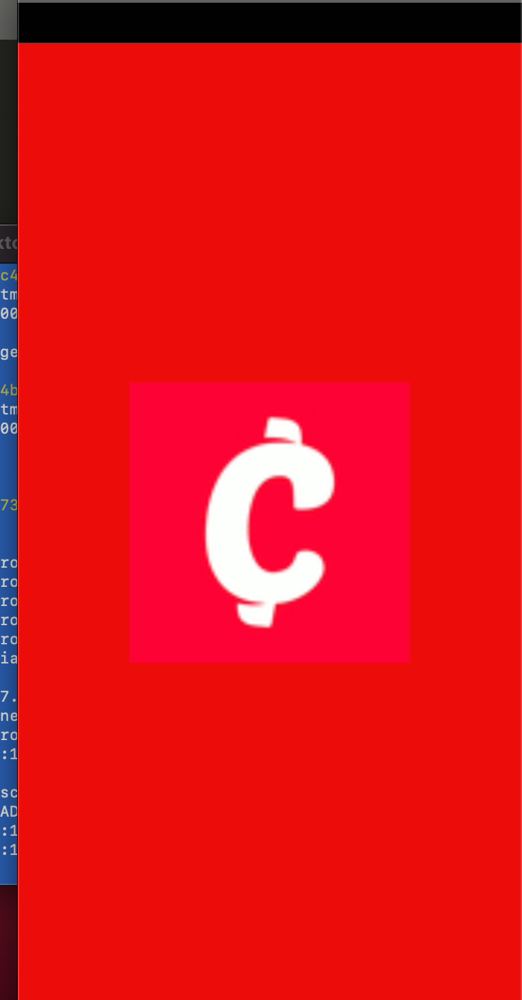
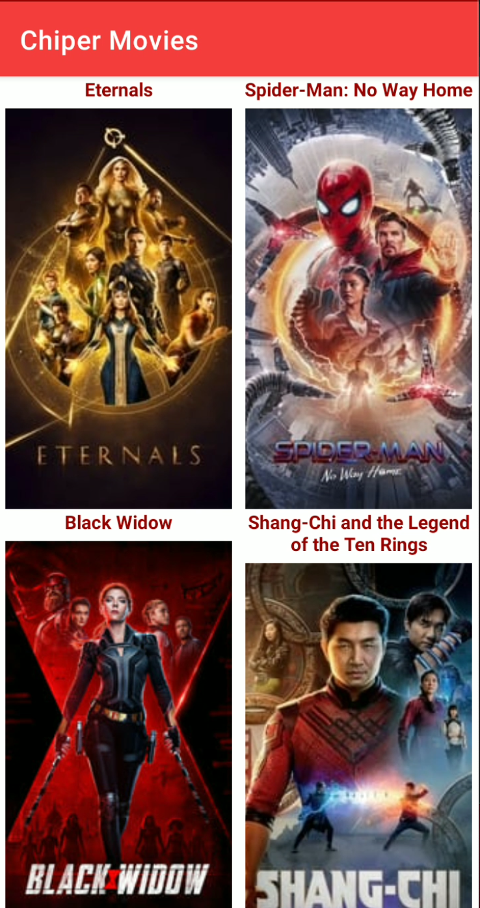
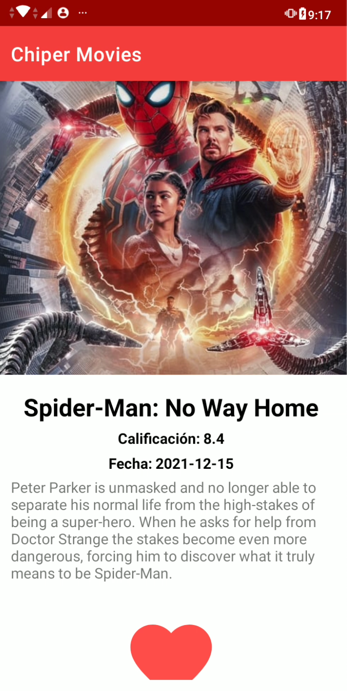

# ChiperTest
Test Chiper

➢ Esta aplicación se desarrollo utilizando:

•	Kotlin
•	Arquitectura MVVM
•	API se consume con Retrofit2
•	Parseo con GSON
•	Manejo de imágenes con Glide
•	AndroidX
•	Base de datos Room
•	RxJava para recargar las pagina con nuevas peliculas

➢ Capas de la aplicación

•	Persistencia: Es la encargada del almacenamiento en el dispositivo, para esta capa se utilizó una clase Repositorio que abstrae el acceso a la base de datos Room.
•	Vistas: Son elementos visuales con los que el usuario puede interactuar, es decir los layouts de activities, fragments y recycler view.
•	Red: Se encarga de consumir el API Rest que provee toda la información que se le mostrará al usuario.
•	Negocio: Es la lógica que define el comportamiento de la aplicación y tratamiento de la información, usualmente la encontramos en los activities y fragments.

➢ MVVM 

•	Modelo: Se encarga de obtener, almacenar y proveer los datos además de la lógica de negocios.
•	Vista: Muestra la información y reacciona ante la interacción del usuario.
•	ViewModel: El el medio que utiliza la vista para acceder a los datos, a la vez, se encarga de notificar la vista cuando los datos han cambiado.

➢ Responsabilidad de los packages

•	adapter: Encontramos los adapter que son los encargados de tomar un objeto y generar las vistas dinámicamente, en este caso para un View Pager en la pantalla principal, lista de videos en el detalle de película y las listas de películas en las categorías y búsqueda.
•	api: Están las clases encargadas de consumir los recursos del API Rest, utilizamos Retrofit2 para los llamados junto a una clase de utilidad que genera los url para las imágenes.
•	db: Clases para manejar la base de datos Room, encontramos el Data Access Object, un convertidor de tipos para almacenar objetos propios en la DB, además la clase que inicializa la DB.
•	model: En este paquete se incluyen todos los modelos de datos a utilizar en la app.
•	repository: Se utiliza Repository Pattern para abstraer el acceso a la información, de esta manera se separan responsabilidades y se puede cambiar la fuente (DB, API o ambos) sin afectar la implementación.
•	ui: Encontramos todas las clases que trabajan directamente con vistas.
•	home: Clases para crear el home de la app el cual está compuesto de un activity con view pager y múltiples fragments.
•	landing: Aquí tenemos las clases para el detalle de las películas.
•	player: La clase encargada de reproducir los clips, recibe el url mediante los extras del intent.
•	search: Este Activity se encarga de manejar las búsquedas, ya sea desde el home, o cualquier intent de búsqueda que reciba la aplicación. Solo se implementó la búsqueda en línea.
•	splash: Esta clase se encarga de mostrar el logo al iniciar la aplicación.
•	utils: En este paquete tenemos clases de utilidad y Manager de Navegación el cual se encarga de dirigir el flujo de las vistas. Aquí utilizamos Singleton Pattern ya que solamente necesitamos una instancia.
•	viewmodel: Tenemos todos los view model que utilizamos en las distintas vistas, su función es proveer y conservar la información independientemente del ciclo de vida de los elementos de la vista.

➢  Recomendaciones

Principio de Responsabilidad Única consiste en que cada clase tendrá una única función o propósito con el propósito de mantener juntas las funcionalidades relacionadas lo que reduce el acoplamiento produciendo un código más flexible, mantenible y testeable.

Un buen código es aquel que se escribe teniendo en cuenta las siguientes consideraciones:

o	Llevar un control de versiones
o	Consultar la documentación en caso de dudas.
o	Se sigue la guía de estilo y nombramiento del lenguaje, framework y plataforma.
o	Se utilizan patrones de diseño.
o	Utilizar un Linter para mantener la calidad del código.
o	No abusar de las reducciones extremas en la sintáxis ya que reducen la legibilidad.
o	Seguir los principios SOLID
o	En el caso de Android se deben hacer pruebas en varios dispositivos con diferentes tamaños y densidades de pantalla, además de diversas marcas y versiones de OS.
o	Seguir buenas prácticas de programación.
o	En el caso de Android se deben hacer pruebas en varios dispositivos con diferentes tamaños y densidades de pantalla, además de diversas marcas y versiones de OS.
o	Seguir buenas prácticas de programación.
o	Documentar y agregar los comentarios para facilitar la lectura y compresión del código.

➢  ScreenShop

  
  
  

